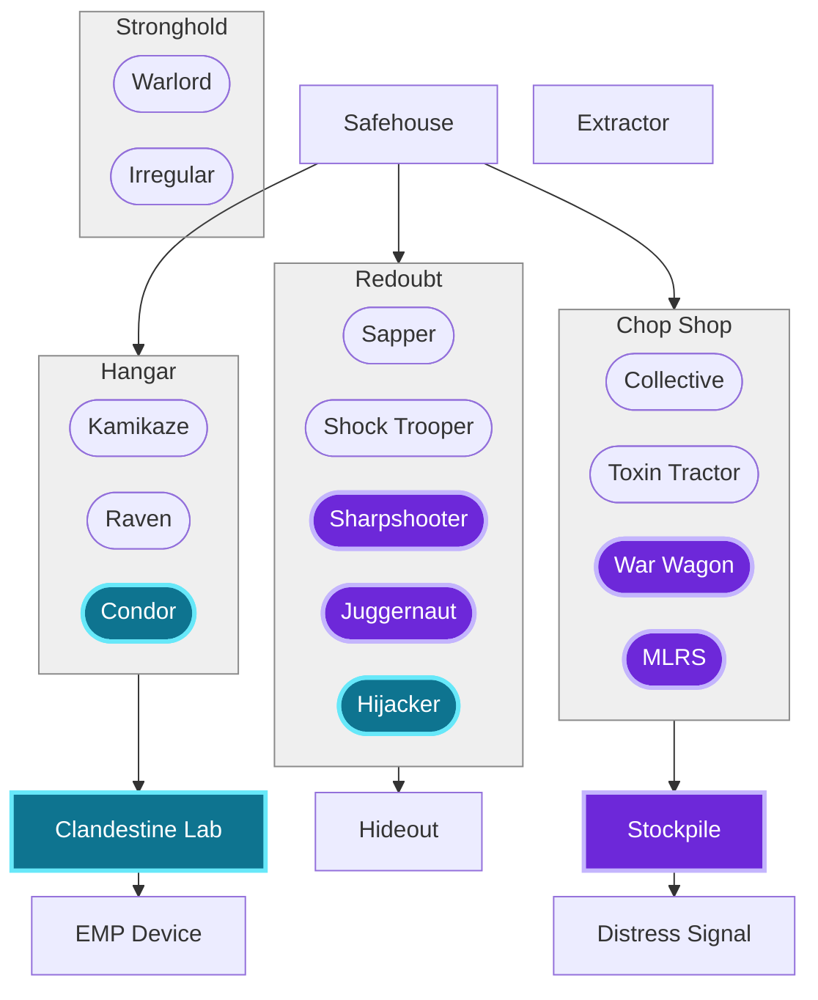

# Anarchists

Generic id `anarchical`; in-game title "Anarchists" (the **Baladians** of the
world-building lore — see [[world-building#Baladians]]).

# Introduction
[[world-building#Baladians|baladians]]
# Overview

| **Themes**   | Guerilla, Scavenge, Greed             |
| ------------ | ------------------------------------- |
| **Minion**   | Combat Infantry                       |
| **Infrastructure**   | Build/occupy terrestrial buildings    |
| **Dominion** | Passively generated by a warlord unit |
- Doctrine
	- Deception, interception, blowing up mistakes
	- Maneuver warfare
- Asymmetric Mechanics
	- Mobility - cheap, mobile helicopters, maybe with stealth
	- Heal - field hospitals
	- Disable - EMP
	- Positioning - blending in with existing buildings
- Unique Mechanics
	- EMPs, Explosives, and Kamikaze
	- Zero Hour Cash Bounty
	- warlord unit AOE bonus
	- cheap stealth options
# Specifics
## Tech Tree



```dataviewjs
await dv.view("_scripts/tech-graph")
```
## Upgrades
- Global
	- All infantry units gain 20% maximum health
- Specific
	- Warlords provide an attack speed buff
	- Safehouses can't be flushed
