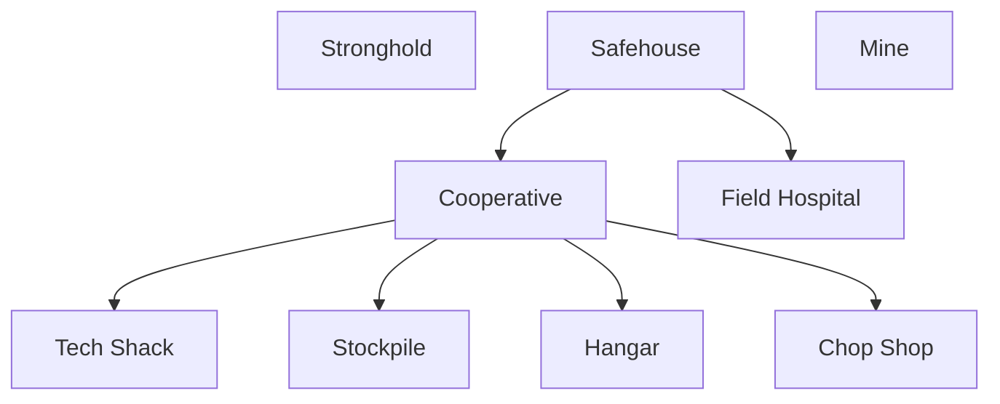

# Introduction
[[world-building#Baladians|baladians]]
# Overview

| **Themes**   | Guerilla, Scavenge, Greed                                |
| ------------ | -------------------------------------------------------- |
| **Minion**   | Combat Infantry                                          |
| Vigor        | Build/occupy buildings                                   |
| **Dominion** | Passively generated by a warlord unit based on veterancy |
| Vibes        | Kimberly                                                 |
- Play Style
	- Deception, interception, blowing up mistakes
	- Leapfrogging with small forces
	- Sniping key targets
- Considerations
	- Focus on Infantry -> Have ways to deal with anti-infantry, e.g. clean toxins
- Asymmetric Mechanics
	- Mobility - cheap, mobile helicopters, maybe with stealth
	- Heal - field hospitals
	- Disable - EMP
	- Boost - warlord unit AOE bonus
- Unique Mechanics
	- some infantry units scavenge parts from vehicles
	- vehicles can be scrapped for money (partial price, any health)
# Specifics
## Tech Tree
| Tier   | Stronghold                     | Hangar                              | Chop Shop |
| ------ | ------------------------------ | ----------------------------------- | --------- |
| Tier 1 | [[#Warlord]] [[#Irregular]] |                                     |           |
|        | Demolitionist                  | [[#Chinook]] [[#Kamikaze Drone]] |           |
|        | Jammer Sharpshooter         | [[#Condor]]                         |           |

# Structures
# Units
## Redoubt
### Warlord
- dominion-generating unit, based on veterancy
- Has a rocket launcher
### Irregular
- cheap, weak anti-infantry
- Builder
## Hangar
### Chinook
- transport chopper
### Kamikaze Drone
- Like scourge in Brood War
- Should probably do AOE and friendly fire - cool and balanced
### Condor
- Plane, drops EMPS (requires Air Tech)
## Redoubt
### Sharpshooter
- sniper unit
- has to deploy, probably
- Maybe stealth?
### Chop Shop
 - Sleeper - small, fast transport vehicle
- Locust - Like patriot system
- Monitor - like quad cannon
- Arc Engine - ECM that deals DOT (requires tech)
- Battle Bus (vehicle tech)
- **Vehicle Tech Dunno**
## Upgrades
- Global
	- All infantry units gain 20% maximum health
- Specific
	- Warlords provide an attack speed buff
	- Safehouses can't be flushed
	- Liberating provides a warlord in addition to irregulars
## Ordnances
- T1
	- promote an irregular to a warlord
	- informant - give an irregular stealth
- T2
	- Ambush
- T3
	- sdf