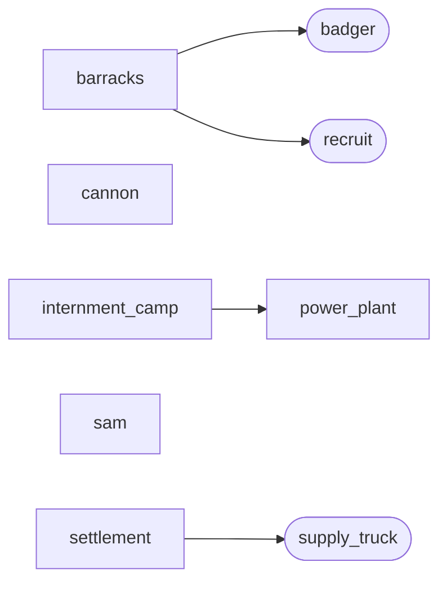

# Colonials

Generic id `colonial`; in-game title "Colonials" (the **Haustoria** of the
world-building lore — see [[world-building#Haustoria]]).

# Introduction
[[world-building#Haustoria|haustoria]]
# Overview
| **Themes**   | Siege, Sprawl, Constitution       |
| ------------ | --------------------------------- |
| **Minion**   | Vulnerable Vehicle                |
| Vigor        | Typical power plants              |
| **Dominion** | Collect neutral or enemy infantry |
| Vibes        | JP                                |
- Play style
	- Tanky, extract units early-game
	- Turtly, difficult to penetrate while aggregating resources
	- siege and outlast opponent
- Considerations
	- Enemy incentive to make anti-infantry infantry -> good anti-vehicle infantry
	- Self-generating dominion -> specific infantry unit for this
- Asymmetric Mechanics
	- Mobility - LACK
	- Disable - sonic interaction with infantry
	- Heal - Supply Truck repairs all mechanical units
	- Boost - deploy vehicles
- Unique Mechanics
	- Artillery spotting system
# Specifics
## Tech Tree

<!-- tech-graph:start -->

<!-- tech-graph:end -->

```dataviewjs
await dv.view("_scripts/tech-graph")
```

# Structures
# Units

Built-out units have their own spec docs: [[supply_truck|Stock Truck]] (Colony);
[[recruit|Pathfinder]], [[badger|Badger]] (Barracks). The entries below are still
design-only.

## Barracks
### Suppressor
- sonic grenades
- flush infantry
## Production Yard

### Carronade
- Solid tank, siege damage
### Sabbath
- Scout unit, stuns infantry
### Shredder
- slow, quad cannon
# Tremor
- idk yet
## Skyport
### Eagle
- raptor
### Helix with anti-infantry gun
### Harbinger
- deploy to give siege signal (req. Tech)
## Upgrades
- Universal
	- 
- Specific
	- POW vehicle speed upgrade
	- Artillery leaves radiation
	- Recruit artillery beacon
## Ordnances
- T1
	- scan
	- promotion - give a target unit veterancy
	- A given structure will be built twice as fast
- T2
	- 
	- 
