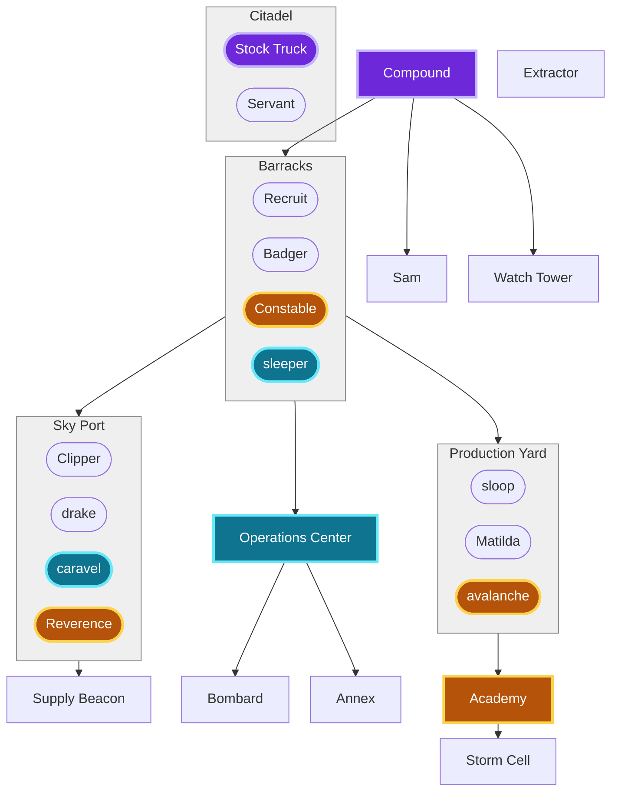

# Colonials

Generic id `colonial`; in-game title "Colonials" (the **Haustoria** of the
world-building lore — see [[world-building#Haustoria]]).

# Introduction
[[world-building#Haustoria|haustoria]]
# Overview
| **Themes**   | Siege, Sprawl, Constitution       |
| ------------ | --------------------------------- |
| **Minion**   | Vulnerable Vehicle                |
| Infrastructure       | internment camps                  |
| **Dominion** | Collect neutral or enemy infantry |
- Doctrine
	- Bombardment
	- Supply Lines
	- Cryogenics
- Asymmetric Mechanics
	- Heal - Servants repair structures and mechs
	- Mobility - intentionally lacking
	- Disable - freeze
	- Positional - [[work_detail|Work Detail]]: a Compound speeds the ability cooldowns of every structure it touches, by 8% per interned Servant
- Unique Mechanics
	- Artillery spotting system
	- Cryogenics as slowing and strengthening
	- Unit and energy shipments
# Specifics

## Tech Tree


```mermaid
%% tech-graph:start
%%{init: {'flowchart': {'nodeSpacing': 25, 'rankSpacing': 18, 'subGraphTitleMargin': {'top': 0, 'bottom': 8}}}}%%
flowchart TB
    classDef tech0 fill:#6d28d9,stroke:#c4b5fd,stroke-width:3px,color:#ffffff
    classDef tech1 fill:#0e7490,stroke:#67e8f9,stroke-width:3px,color:#ffffff
    classDef tech2 fill:#b45309,stroke:#fcd34d,stroke-width:3px,color:#ffffff
    subgraph cl_commandCenter["Citadel"]
        cl_mechLight_dominionGen(["Stock Truck"])
        cl_bioLight_builder(["Servant"])
    end
    cl_infrastructure["Compound"]
    nt_extractor["Extractor"]
    subgraph cl_barracks["Barracks"]
        cl_bioLight_antiLight(["Recruit"])
        cl_bioLight_antiMech(["Badger"])
        cl_bioMedium_antiStrong(["Constable"])
        cl_bioLight_stealth(["sleeper"])
    end
    cl_defense_antiAircraft["Sam"]
    cl_defense_antiLight["Watch Tower"]
    subgraph cl_airField["Sky Port"]
        cl_aircraftLight_antiLight(["Clipper"])
        cl_aircraftMedium_antiMech(["drake"])
        cl_aircraftStrong_transport(["caravel"])
        cl_aircraftMedium_support(["Reverence"])
    end
    cl_tech1["Operations Center"]
    subgraph cl_warFactory["Production Yard"]
        cl_mechMedium_antiLight(["sloop"])
        cl_mechMedium_antiMech(["Matilda"])
        cl_mechStrong_support(["avalanche"])
    end
    cl_support2["Supply Beacon"]
    cl_defense_antiStructure["Bombard"]
    cl_support1["Annex"]
    cl_tech2["Academy"]
    cl_support3["Storm Cell"]
    cl_airField --> cl_support2
    cl_barracks --> cl_airField
    cl_barracks --> cl_tech1
    cl_barracks --> cl_warFactory
    cl_infrastructure --> cl_barracks
    cl_infrastructure --> cl_defense_antiAircraft
    cl_infrastructure --> cl_defense_antiLight
    cl_tech1 --> cl_defense_antiStructure
    cl_tech1 --> cl_support1
    cl_tech2 --> cl_support3
    cl_warFactory --> cl_tech2
    class cl_infrastructure,cl_mechLight_dominionGen tech0
    class cl_tech1,cl_aircraftStrong_transport,cl_bioLight_stealth tech1
    class cl_tech2,cl_aircraftMedium_support,cl_bioMedium_antiStrong,cl_mechStrong_support tech2
    style cl_airField fill:#80808020,stroke:#8a8a8a,stroke-width:1px
    style cl_barracks fill:#80808020,stroke:#8a8a8a,stroke-width:1px
    style cl_commandCenter fill:#80808020,stroke:#8a8a8a,stroke-width:1px
    style cl_warFactory fill:#80808020,stroke:#8a8a8a,stroke-width:1px
%% tech-graph:end
```

```dataviewjs
await dv.view("_scripts/tech-graph")
```

## Structures
- Shipping Dock - dispatch reinforcement drops, req barracks
- Logistics Center - Tech
- storm cell - super weapon, req tech
## Upgrades
- Specific
	- POW vehicle speed upgrade
	- Artillery leaves radiation
	- Recruit artillery beacon