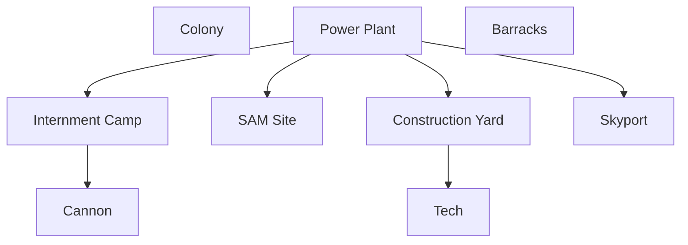

# Introduction
[[world-building#Haustoria|haustoria]]
# Overview
| **Themes**   | Siege, Sprawl, Constitution       |
| ------------ | --------------------------------- |
| **Minion**   | Vulnerable Vehicle                |
| Vigor        | Typical power plants              |
| **Dominion** | Collect neutral or enemy infantry |
| Vibes        | JP                                |
- Play style
	- Tanky, extract units early-game
	- Turtly, difficult to penetrate while aggregating resources
	- siege and outlast opponent
- Considerations
	- Enemy incentive to make anti-infantry infantry -> good anti-vehicle infantry
	- Self-generating dominion -> specific infantry unit for this
- Asymmetric Mechanics
	- Mobility - LACK
	- Heal - dominion infantry also repairs shit
	- Bonus - signal boosting units for artillery
- Unique Mechanics
	- mines last longer
	- Artillery spotting system
# Specifics
## Tech Tree

| Tier   | Colony           | Barracks                       | Production Yard | Skyport |
| ------ | ---------------- | ------------------------------ | --------------- | ------- |
| Tier 1 | [[#Stock Truck]] | [[#Pathfinder]] [[#Badger]] |                 |         |
| Tier 2 |                  |                                | Rail Tank       |         |
| Tier 3 |                  |                                |                 |         |

# Structures
# Units
## Colony
### Stock Truck
- Builder
- ridiculous armor, builds
- Collects POWs for dominion
## Barracks
### Pathfinder
- Basic infantry unit
- Siege spotter
### Badger
- Basic anti-armor unit, long range rockets
### Suppressor
- sonic grenades, stun infantry
## Production Yard
## Skyport

- **Quarters** - Population and Dominion
	- SAM Site - air, detects stealth
	- **Barracks** - Makes Infantry
		- 
		- **Bombard** - Cannon structure
		- **War Factory**
			- Medusa - scout vehicle, like a China ECM but for infantry
			- Pitbull
			- Rhino
			- Shredder - slow, quad cannon
			- Tempest - shatterer, long range, vs inf and light armor (req. Tech)
			- **Airport**
				- Eagle - raptor
				- Helix with anti-infantry gun
				- Harbinger - detector, deploy to extend siege range (req. Tech)
## Upgrades
- Universal
	- 
- Specific
	- POW vehicle speed upgrade
	- Shredder speed upgrade
	- Artillery leaves radiation
## Ordnances
- passive
	- dd
	- 
- active
	- scan
	- place artillery beacon somehow
	- 