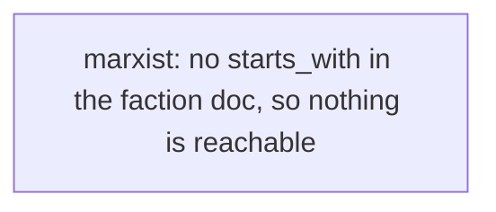

# Introduction
[[world-building#Tselerate Coalition|tselerate-coalition]]
# Overview

| **Themes**   | Sacrifice, Firepower, Tempo |
| ------------ | --------------------------- |
| **Minion**   | Combat Vehicle              |
| **Infrastructure**    | Commie block                |
| **Dominion** | Damage structures           |
- Play style
	- early rush/harass/poke
	- tempo
	- Glass cannon
- Constraints
	- Generating dominion - All maps should have neutral buildings
- Asymmetric mechanics
	- Mobility - speed modifiers for units
	- Heal - LACK
	- bonus - frenzy: units destroying buildings get temporary bonus
	- Positional - frenzy
- Unique Mechanics
	- "add oil" mechanic, sacrifices health for frenzy
# Specifics
# Tech Tree



```dataviewjs
await dv.view("_scripts/tech-graph")
```

- **Union**
- **Quarry**
- **Mine**
- **Housing Block**
	- Flame Turret
	- SAM Site
	- **Garrison**
		- minigunner - light infantry that shoots up
		- Arsonist - unit with plasma grenades, destroys buildings and overdrives friendly things
		- Plasma gunner - fucks infantry, good against light vehicles (tech)
		- **War Factory**
			- Tank
			- APC, shoots up
			- flame tank
			- Bomb Truck (req. Tech)
			- Overlord (tech, super unit)
		- **Air place**
			- Napalm aircraft, toggle to spread fire, limited amount
			- bombs in a line (req. Tech)
## Upgrades
## Sanctions
- T1
	- Ignite a given friendly unit
- T2
	- Frenzy - temporarily give a set of units more movement speed
- T3
	- asdasd