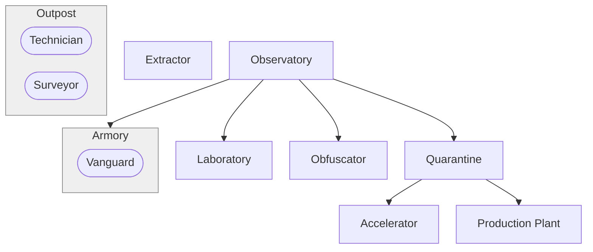

# Introduction
[[world-building#Successors of Tenjin|successors-of-tenjin]]
# Overview

| **Themes**   | Advanced, Volatile, Elusiveness                                        |
| ------------ | ---------------------------------------------------------------------- |
| **Minion**   | Vulnerable Infantry                                                    |
| Infrastructure        | Reconnaissance Vehicles                                                |
| **Dominion** | Reactors generate, but have some byproduct that needs to be dealt with |
- Play Style
	- slow to start, needs some tech
	- High risk, high reward
	- checkmate
- Constraints
	- Deal with air harass vs buildings -> Good anti-air options
- Asymmetric mechanics
	- Mobility - portals
	- Heal - technicians can repair mechs and vehicles
	- disable - ~~hacking structures~~
	- positional - portals seem fine
- Unique Mechanics
	- Lab discharge
	- technicians build units on battlefield
# Specifics
## Tech Tree



```dataviewjs
await dv.view("_scripts/tech-graph")
```


## Compound
- minigunner, expensive and strong, shoots up
- lazer soldier
- Cyborg, lazer swords (T2 tech)
## Dispatch
- Looking Glass - observer
- Rainbird - drops off nuke shit
- Dunno - Anti-personnel and aircraft helicopter
- Siege Prism - flying artillery, redirects lazers (tech)
## Science Lab
- **Lazer Turret** - short range, shoots up, detects
- **Portal**
- T1 Tech
	- Buggy
	- Slingshot
	- Scorpion
	- **T2 Tech**
		- magnetron - magnetizes ballistics, one-way portal
		- Nuke Cannon, taking charges from science lab
		- **T3 Tech**
			- Giant Walker (super unit)
## Upgrades
Rainbirds can carry units
Science labs have more capacity
Galvanizer powers up more quickly
Technicians resistant to toxins
technicians build things more quickly
Missile with toxins, drains a science lab
## Sanctions
- Scan
- Technician drop
# Scenarios
## Tutorial
- Start with a building (idk what kind)
- abilities: 
	- technician drop
	- Upgrade rainbird garrison
	- Unlock target teleport
## Sanctions
- T1
	- Haste - give a single unit 50% more movement speed for some time
- T2
	- Turns a group of technicians into sentries
	- 
- T3
	- particle cannon
	- Teleport units from teleporter anywhere