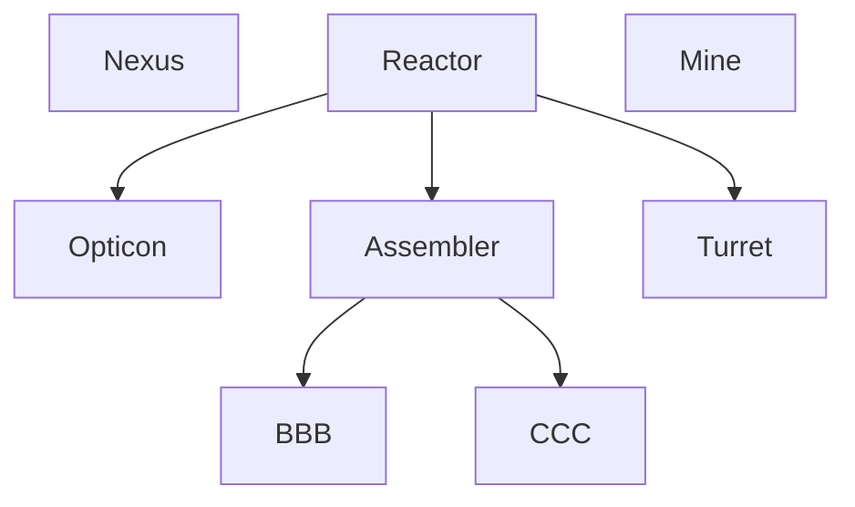

# Introduction
[[world-building#The Warden|the-warden]]
# Overview
| **Themes**   | Decentralized, Aerial, Pacifying                              |
| ------------ | ------------------------------------------------------------- |
| **Minion**   | Slow Aircraft                                                 |
| Vigor        | Large power plant building                                    |
| **Dominion** | Build an obelisk, where dominion is generated per nearby area |
| Vibes        | Elena                                                         |
- Play Style
	- Unaggressive, booming at the start
	- Lots of hit-and-run
	- overwhelming if left unchecked
- Constraints
	- Early Air Options -> Some kind of air vulnerability, e.g. no early anti-infantry aircrafts
- Asymmetric Mechanics
	- Mobility - lots of flying units, even at low tech
	- Heal - nanobots for slow heal over time, a la Zerg
	- Disable - rocket defense systems
	- bonus - bonus XP for units that are alone (passive? Higher rate per kill?)
- Unique Mechanics
	- quick heal mechanic
	- drones can attach to larger mechanical units
# Specifics
## Tech Tree

| Tier   | Nexus       | Assembler                      | [[#BBB]] | [[#CCC]] |
| ------ | ----------- | ------------------------------ | -------- | -------- |
| Tier 1 | [[#Canary]] | [[#Interceptor]] [[#Harpy]] |          |          |
| Tier 2 |             | [[#Sentinel]]                  |          |          |
| Tier 3 |             |                                |          |          |

# Structures
# Units
## Nexus
### Canary
- Flying builder unit
## Assembler
### Interceptor
- cheap drone with anti-infantry melee
- does EMP
	- shot as EMP when attached to air units, shock melee when on ground units
### Sentinel
- lazer drone, with lock-on ability
### Harpy
- flying drone with rockets
### Peacekeeper
- floating drone with gattling, detects stealth (req. Tech)
## BBB
### Surveyor
- anti-infantry vehicle, can use a drone
### Paladin
- lazer tank
### Gattling tank - ...
### Matrix
floats, creates arcs between drones, zaps missiles (req. tech)
### Absolution
- Late-game floating fortress that can build and attach multiple drones (req. late tech, super unit)
 ## CCC
### Falcon
- fighter
### Viper
- single target elimination
### Purifier
- aurora bomber (req. tech)
# Specifics
## Tech Tree
- **Nexus** - Main building
	- 
	- **Quarry** - you know
	- Opticon - Generates dominion for each nearby empty tile
	- **Reactor** - supports a lot of population
		- **Patriot** - missiles, detects stealth
		- **Repair Station**
		- **Assembler** - T1 production
			- 
			- **Cyber Uplink**
				- **Quantum Mainframe**
			
			-
## Upgrades
- Generic
	- Rocket speed upgrade
	- No cooldown on unit self-repair
	- Increased lazer damage
	- Faster gatling spin-up time
	- Airplanes accelerate faster (less damage, better at escaping rockets) and arm faster
- Specific
	- decrease interceptor timer
	- make allied interceptor shock invulnerable
	- upgrade harpy repair speed
	- Falcon payload size
	- interceptor shock deals damage
	- Increase surveyor line of sight
	- vipers can clear garrisons
## Ordnances
- Upgrades
	- presence of drones doesn't impact XP
	- Interceptors can steal enemy units
	- Viper stealth
	- 
- Uses
	- particle cannon
	- Deploy peacekeeper drones anywhere
	- repair drone boost
	- Short-circuit a single unit