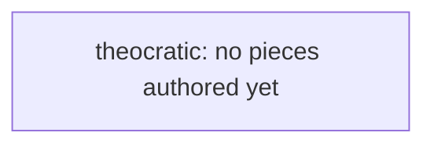

# Overview

| **Themes**   | Devotion, Hierarchy, Imposition     |
| ------------ | ----------------------------------- |
| **Minion**   | Vulnerable Vehicle                  |
| Vigor        | Slow aircraft, like Overlords       |
| **Dominion** | Capture shelters, like AOE4 shrines |
| Vibes        | Zangief                             |
- Play style
	- ...
# Specifics
# Tech Tree

<!-- tech-graph:start -->

<!-- tech-graph:end -->

```dataviewjs
await dv.view("_scripts/tech-graph")
```

- 
## Upgrades
## Ordnances
- T1
	- divination - provide vision of all shelters on the map
- T2
	- mind control
- T3
	- 