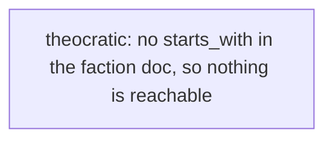

# Overview

| **Themes**   | Devotion, Hierarchy, Imposition     |
| ------------ | ----------------------------------- |
| **Minion**   | Vulnerable Vehicle                  |
| Infrastructure        | Slow aircraft, like Overlords       |
| **Dominion** | Capture shelters, like AOE4 shrines |
- Doctrine
	- 
	- 
	- 
- Asymmetric Mechanics
	- Heal
	- Mobility
	- Disable
	- Positional
- Unique Mechanics
	- 
	- 
	- 
# Specifics
# Tech Tree


```mermaid
%% tech-graph:start
flowchart LR
    empty["theocratic: no starts_with in the faction doc, so nothing is reachable"]
%% tech-graph:end
```

```dataviewjs
await dv.view("_scripts/tech-graph")
```

- 
## Upgrades
## Sanctions
- T1
	- divination - provide vision of all shelters on the map
- T2
	- mind control
- T3
	- 