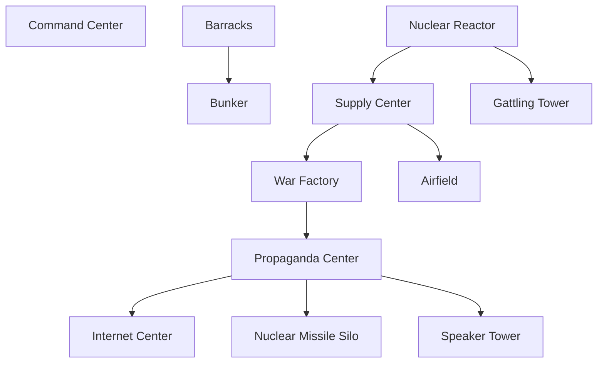
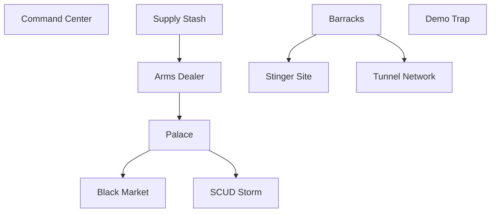
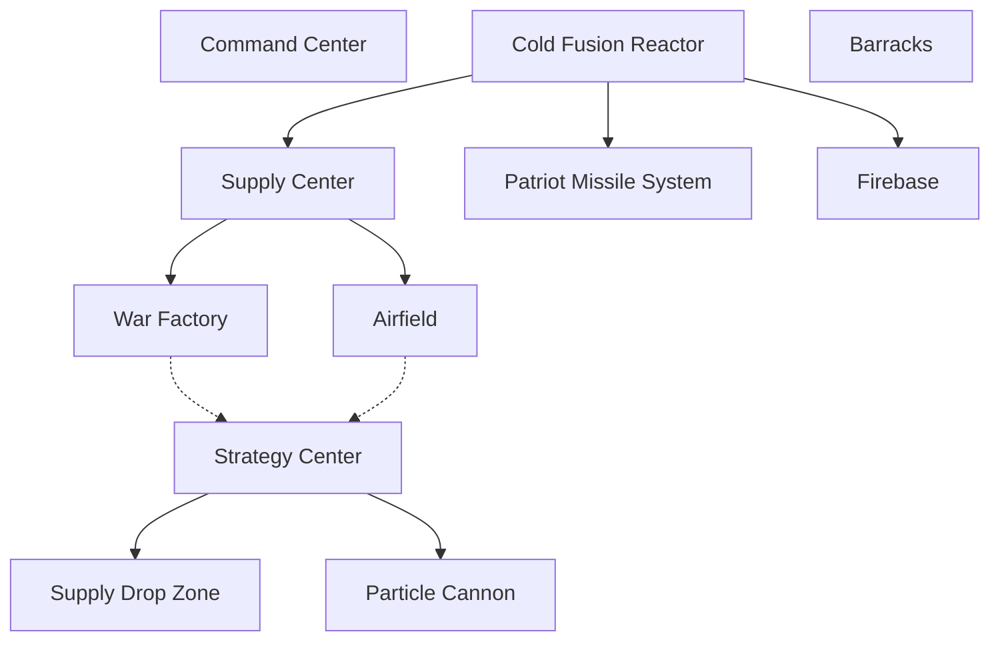

# Games

## Highlights

| Name                    | References                                        | Mechanics                                 | Pros | Cons                                                                                                                                  |
| ----------------------- | ------------------------------------------------- | ----------------------------------------- | ---- | ------------------------------------------------------------------------------------------------------------------------------------- |
| Doorkickers             |                                                   | Ability to pause and plan out engagements |      |                                                                                                                                       |
| Character loadouts      | A lot of depth of gameplay with loadouts and such | Max ~5 units                              |      |                                                                                                                                       |
| Tooth and Tail          |                                                   | Fast paced RTS gameplay                   |      | All gameplay is centered around your character, so you can’t do much micromanagement                                                  |
| Advanced Wars           |                                                   | Map control development                   |      | It’s hard to compete in turn-based games with people that have more experience than you, because you can’t out-play them in real time |
| C&C Rivals              |                                                   | Fast paced gameplay                       |      |                                                                                                                                       |
| Loadout system          |                                                   | Small setting for matches                 |      |                                                                                                                                       |
| AOE3                    |                                                   | City Cards                                |      |                                                                                                                                       |
# Physics
## RPS
- SC2 suffers from excessive countering such that all units can melt each other
## Interactions
# Asymmetries
## Systems

| Game     | Asymmetry                                   | Notes                                               |
| -------- | ------------------------------------------- | --------------------------------------------------- |
| SC2      | Supply Providers                            | Overlords vs pylons vs supply depots                |
|          | Building methods                            | SCV build, Probe warp, drone thingy                 |
|          | Different healing methods                   | Terran repair and heal, Protoss shields, zerg regen |
|          |                                             |                                                     |
| Generals | Different resource collectors               | GLA infantry, Chinese trucks, USA chinooks          |
|          | Aircrafts                                   | GLA lacks aircrafts                                 |
|          | only some factions have power               |                                                     |
|          | same base infantry with different abilities |                                                     |
|          | Different defenses                          |                                                     |
|          | Disable                                     | Saboteur, leaflet, ECM                              |
|          | Different building clear                    | flashbangs, fire, toxins                            |
|          | Contamination                               | Fire and toxins - USA lacks?                        |
|          | Unit Bonuses                                | GLA scraps, China Horde, USA Pilot                  |
## Faction Themes
### Generals
- USA
	- Lazer defenses
	- self-repairing buildings
	- aircraft focus
	- Pilots
	- vehicle drones
	- strategy center modes
- China
	- Critical mass focus
	- mines
	- AOE healing
	- Nukes (artillery, power generation, exploding tanks)
	- AOE effects (firestorm, flame wall, nukes)
- GLA
	- Scavenging
	- Tunnels
	- Invisibility
	- Terrorist units + demo traps
	- Fast vehicles
	- GLA Hole + fake buildings

TODO put this somewhere: [ZeroSpace resources](https://www.youtube.com/watch?v=bYPsNj3p_LM)
# Zero Hour Tech Trees
## China

## GLA

## USA

